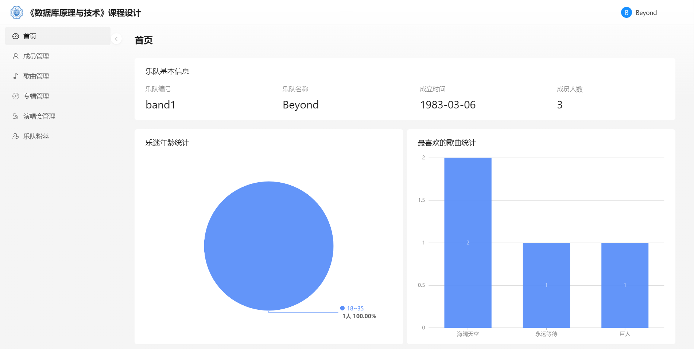

# 乐队歌迷管理系统

<div align="center">
[](https://github.com/jscslld/db_course_design/actions)
[](https://github.com/jscslld/db_course_design/graphs/contributors)
[](https://github.com/jscslld/db_course_design/commits)
[](https://github.com/jscslld/db_course_design/issues)


</div>
## 业务场景

某个数据库记录乐队、乐队成员、专辑、歌曲、演唱会和歌迷的信息：

每个乐队包括名称、成立时间等，每个乐队有一个队长；

乐队每位成员包括名字、性别、年龄、乐队分工等，每个成员有加入乐队的时间，（如果中途离开）有离开乐队的时间；

专辑包括专辑名称、发表时间、表演乐队、发行公司等；

歌曲包括歌曲名称、创作者姓名、所在专辑等；

演唱会包括举办时间、举办地点、演出乐队等；

歌迷包括姓名、性别、年龄、职业等。

规定每个乐队只有一名队长，每个乐队成员同一时期只能加入一个乐队，一个乐队发行多张专辑，专辑中含有多首歌曲，每场演唱会都有表演歌单，乐队演唱多首歌曲，同一首歌可以被多个乐队演唱，歌迷可以喜欢多个乐队、专辑及歌曲，歌迷可参与多场演唱会。

根据此业务场景建立相应的数据库系统与应用系统。

## 作业要求

**1）需求分析**

分析该场景中的数据结构，可能有什么完整性和安全性要求。

产生需求分析报告

**2）概念设计阶段**

用E-R图实现以上需求分析报告内容。

**3）逻辑模型设计**

选用关系数据库，根据E-R图建立数据库关系模型；

优化关系模型：应用数据库规范化理论，确定各关系模式分别属于第几范式，判断是否存在部分函数依赖、传递函数依赖与多值依赖等，对关系模式进行必要分解，达到优化效果。

**4）物理模型设计**

简单叙述本数据库存取方法与存储模型的选择。

**5）数据库实施**

在MySQL中创建数据库，生成数据表（创建时要考虑到实体完整性约束、参照完整性约束以及用户定义完整性约束，保证数据库的完整性）；

初始化数据加载，自己录入一批数据。

**6）数据库安全性实施**

创建不同类型数据库用户：数据库管理员用户admin、乐队用户band和用户歌迷fan，要求管理员用户拥有所有数据库权限；乐队用户可以维护乐队信息、成员信息、专辑信息、歌曲信息、演唱会信息，可以查看歌迷信息；歌迷用户可以维护歌迷信息、喜欢的乐队、专辑、歌曲、演唱会信息，查看乐队信息、成员信息、专辑信息、歌曲信息、演唱会信息等；

利用视图机制，使某个乐队用户Band1只能查看自己的歌迷信息，并利用视图实现简单的歌迷人数统计、年龄范围统计、最喜欢的歌曲统计等；

分别使用以上不同用户登录数据库，进行相应的操作，验证以上措施的有效性；

针对本应用安全要求，叙述还可以有什么数据库安全性保护措施。

**7）数据库完整性实现**

在乐队表中添加一个属性：成员人数，然后在成员表建立一个触发器，要求如下：当成员加入或退出乐队时，该乐队成员人数随之改变；

进行乐队成员增加或删除操作，验证触发器有效性

可根据业务场景，自行添加完整性要求

**8）基于数据库的应用开发**

实现用户登录功能，可选择为乐队用户或歌迷用户。

使用乐队用户登录，要求实现以下功能：

显示、发布、修改、删除本乐队相关信息，包括乐队信息、成员信息、专辑信息、歌曲信息、演唱会信息；

查看歌迷相关信息，包括乐队歌迷信息、喜欢本乐队专辑、歌曲的歌迷信息，参加本乐队演唱会的歌迷信息等；

使用乐迷用户登录，要求实现以下功能：

本乐迷用户身份信息维护；

显示本乐迷所喜欢的乐队、专辑、歌曲，参加的演唱会信息等，可以点开每一行查看详细信息；

该乐迷可以添加、删除、修改喜欢的乐队、专辑、歌曲，参加的演唱会等；

该乐迷可以查看所有未关注的乐队、专辑、歌曲、演唱会信息（可增加查询功能）

可自行添加相应功能

## 概念模型设计


## 逻辑模型设计

根据E-R图，可建立如下所示的关系模式：

乐队成员（$\underline{\text{成员编号}}$，姓名，性别，年龄，乐队分工，加入时间，离开时间，所属乐队）

乐队（$\underline{\text{乐队编号}}$，乐队名称，成立时间，队长编号）

专辑（$\underline{\text{专辑编号}}$，专辑名称，发行公司，发表时间，发行乐队）

歌曲（$\underline{\text{歌曲编号}}$，歌曲名称，创作者编号）

演唱会（$\underline{\text{演唱会编号}}$，开始时间，结束时间，举办地点，举办乐队，人数上限）

演唱会歌单（$\underline{\text{演唱会编号，歌曲编号}}$，演唱顺序）

专辑歌单（$\underline{\text{专辑编号，歌曲编号}}$）

歌迷（$\underline{\text{歌迷编号}}$，姓名，性别，年龄，职业）

报名（$\underline{\text{演唱会编号，歌迷编号}}$，报名时间）

喜欢歌曲（$\underline{\text{歌迷编号，歌曲编号}}$）

喜欢乐队（$\underline{\text{歌迷编号，乐队编号}}$）

喜欢专辑（$\underline{\text{歌迷编号，专辑编号}}$）

## 开发环境

本系统基于前后端分离的思路进行开发，前端基于React开发，后端开发语言为Java 17，使用Spring Boot 2.7与Mybatis-plus框架。具体的开发工具、开发框架和系统依赖见下表。


## 系统功能清单

系统分为管理端、乐队端和歌迷端。管理端、乐队端和歌迷端均通过统一身份鉴别进行登录与权限分配，系统的登录用户名和角色均为直接使用MySQL自带的用户机制和角色机制，而不是利用基本表做的逻辑映射，即当用户在本系统登录时，系统会将当前会话的数据源切换到用户对应的同名MySQL用户下。利用动态数据源和上文提到的视图机制可以最大限度地保证数据的安全。

管理端提供乐队管理与歌迷管理两大功能，其主要作用是将应用程序与MySQL的角色、用户之间打通。管理员可以利用管理端轻松的创建和删除乐队和歌迷账号。

乐队端分为乐队基本信息、成员管理、歌曲管理、专辑管理、演唱会管理、乐队粉丝列表等功能。乐队管理员利用分配到的乐队账号登录到平台后，可以方便地查看并维护自己乐队的相关信息。

歌迷端分为歌迷基本信息、乐队信息、歌曲信息、专辑信息和演唱会信息五大板块。歌迷可通过本系统查看自己喜欢的乐队、歌曲、专辑列表，暂未喜欢的乐队、歌曲、专辑列表和全部的乐队、歌曲、专辑列表，并可以喜欢或取消喜欢乐队、歌曲和专辑，报名或取消报名演唱会。系统还为歌迷提供了查看乐队、歌曲、专辑、演唱会具体详情的功能。


## 部分页面截图

### 登陆页面


### 管理员端


### 乐队端




### 歌迷端


## 部署方法

### 系统环境

本教程使用Ubuntu 22.04 LTS进行演示安装，安装的docker版本为20.10.22，docker compose版本为2.14.2。

### 安装docker

#### 安装相关依赖

```bash
sudo apt-get update
sudo apt-get install \
   ca-certificates \
   curl \
   gnupg \
   lsb-release
```

#### 添加GPG密钥

```bash
curl -fsSL http://mirrors.aliyun.com/docker-ce/linux/ubuntu/gpg | sudo apt-key add -
```

#### 建立docker资源库

```bash
sudo add-apt-repository "deb [arch=amd64] http://mirrors.aliyun.com/docker-ce/linux/ubuntu $(lsb_release -cs) stable"
```

#### 安装docker

```bash
sudo apt-get install docker-ce docker-ce-cli containerd.io
```

#### 启动docker

```bash
sudo systemctl enable docker
sudo systemctl start docker
```

#### 验证安装

输入`sudo docker info`，出现类似下图的输出表示安装成功。


### 安装docker compose

```bash
sudo curl -sL https://get.daocloud.io/docker/compose/releases/download/v2.14.2/docker-compose-`uname -s`-`uname -m`  -o /usr/local/bin/docker-compose
sudo chmod +x /usr/local/bin/docker-compose
```

### 部署系统

#### 前期准备

将代码上传至服务器，并进入代码文件夹内

#### 部署启动系统

```bash
docker-compose up -d
```

出现如下图所示的输出表示正在进行部署


出现如下图所示的输出后表示部署成功


### 初始化系统

在浏览器中输入`http://127.0.0.1:8088/user/login`即可进入系统。


输入用户名admin，密码123456，选择管理员身份登陆系统。


点击创建登录用户，输入待初始化的密码后，即可创建对应的乐队登录账号和歌迷登陆账号。


